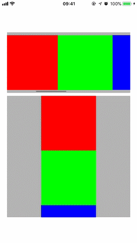

# INFView
This is implementation of infinite scroll view - a scroll view which allows to scroll content in both forward and backward directions infinitely.

## Example

## Usage
1. Use INFScrollView class which is subclass of UIScrollView.
2. Proviede the datasource object which adopts INFScrollViewDataSource protocol to provide arranged subviews with content for scrolling. INFScrollView allows to postone creation of arranged subviews until they will be displayed. You do not need to add content subviews manually into an istance of the INFScrollView.
3. You also can postpone size caluclation of subviews by implementing infScrollView:estimatedSizeForViewAtIndex: and infScrollView:sizeForViewAtIndex: methods of the INFScrollViewDataSource. If you do not implement these methods INFScrollView will suppose that each arranged subview has the same size as the INFScrollView instance.
4. Review the INFViewExample project as an example of usage of INFScrollView.

**Restriction on minimal count and size of content views**: To implement infinite scrolling the content views are groupped into three continuous, non-overlaping groups - leading, middle and trailing. Infinite scrolling is possible only when all three groups have non-zero length, length of leading and trailing groups is equal or bigger than half of length of scroll view and length of both and leading+middle and middle+trailing is equal or bigger than scroll view length.
